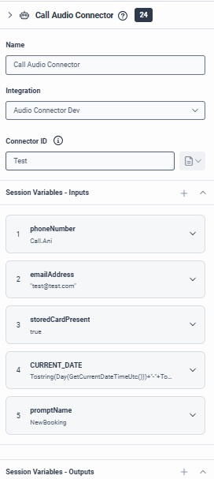

# VoiceAgent Sample Implementation

### Purpose
This repository contains a sample implementation for VoiceAgent based on AudioConnector Server. This can be used as a guide to help understand some of the basics of setting up an AudioConnector Server and how it can be used to develop an integration with VoiceAgent Platforms. 
It is not intended for production purposes. Protocol documentation can be found on the [Genesys Developer Portal](https://developer.genesys.cloud/devapps/audiohook/).

## Project Setup & Installation

### Prerequisites
- Node.js version **18 or higher** is required.
- TypeScript is used for development.
- `ts-node` is used for development-time execution.

### Available Scripts
npm start - Starts the application using ts-node.
npm run build - Cleans and builds the project.
npm run clean - Removes all compiled files in dist/.
npm test - Placeholder for future test implementation.

### 📦 Notable Dependencies
-Runtime
--express: Web server for handling HTTP requests.
--websocket / ws: WebSocket servers and clients.
--uuid: For generating unique IDs.
--dotenv: Loads environment variables from a .env file.
--axios: HTTP client for API requests.
--lodash: Utility functions for data manipulation.
--iso8601-duration: Parses ISO8601 time durations.

### Running the server

#### Requirements
This implementation was written using NodeJS 18.16.0 as a target. If you are using a Node version manager, there is a [nvmrc](./.nvmrc) file that specifies this version.

#### Steps to run the server locally
1) Run `npm install` in the root of the project.
2) Run `npm run start` in the root of the project to start the server. The port can be adjusted from within the [environment](./.env) file.

### Genesys Cloud Pre-requisites

- Setup Audio connector Integration in your Environment [AudioConnector](https://help.mypurecloud.com/articles/audio-connector-overview/)

- In the Architect Flow invoke the Call Audio Connector Block Pass all variables referred to in the Prompt - including Prompt Name

The above screenshot assume we have NewBookingPrompt and corresponding Toolset created under the prompts folder (see below)
### Setting up Voice Agent Prompt
Create a [Prompt](./src/prompts/NewBookingPrompt.md) and Corresponding [Tool](./src/prompts/NewBookingTools.json)

### External Dependencies
- Setup an OpenAI API Key/Subscription
- Voice Agent Integration is with [Open AI Realtime API](https://platform.openai.com/docs/api-reference/realtime)
- Setup NGrok if require testing from local PC

### Development
-typescript, ts-node: TypeScript tooling for compiling and executing code.
-rimraf: Cross-platform rm -rf equivalent for cleaning directories.
-@types/*: Type definitions for Express, Node.js, WebSocket, and other libraries.

#### The main session object
The [Session](./src/websocket/session.ts) class contains methods and logic that handle communicating with the AudioConnector Client (which is Genesys Cloud).

The [ASRService](./src/services/asr-service.ts) class is responsible for interpreting the incoming audio from the AudioConnector Server. A fake implementation has been provided, and will need to be replaced with an actual ASR engine.

The [BotService](./src/services/bot-service.ts) class is responsible for getting the metadata for a specified Bot, as well as interacting with the Bot itself. For example, this service would be used to match a Bot's response to the input received/interpreted from the `ASRService` and `DTMFService` services. A fake implementation has been provided, and will need to be replaced with an actual Bot engine.

The [DTMFService](./src/services/dtmf-service.ts) class is responsible for interpreting any DTMF digits received from the AudioConnector Client. A base implementation has been provded as a start, but will need to be adjusted to meet any specific requirements for the AudioConnector Server.

The [SecretService](./src/services/secret-service.ts) class is responsible for looking up the secret from a given API Key used during the initial authentication process. A fake implementation has been provided, and will need to be replaced to lookup secrets with whatever service they are stored in.

The [TTSService](./src/services/tts-service.ts) class is responsible for converting text-based responses from the Bot to the appropriate audio to be sent to the AudioConnector Client. A fake implementation has been provided, and will need to be replaces with an actual TTS engine.

